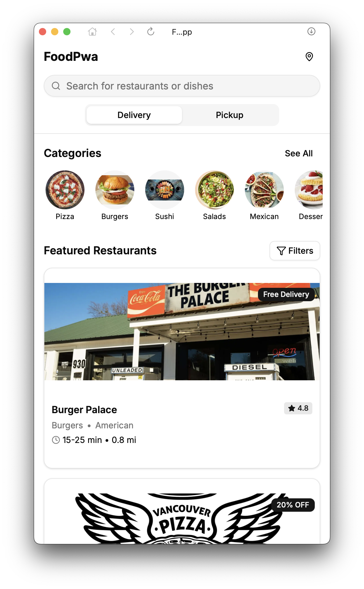
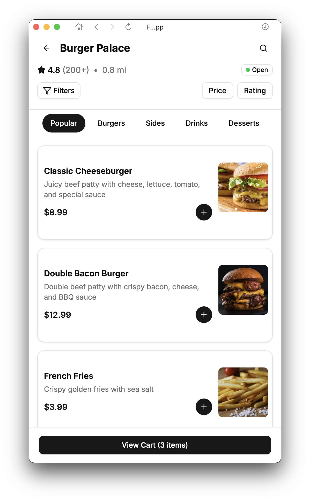

# FoodPwa

**FoodPwa** to nowoczesna aplikacja PWA do zamawiania jedzenia, zbudowana na frameworku **Next.js**. Pozwala użytkownikom wygodnie przeglądać restauracje, kategorie potraw, menu oraz składać zamówienia z dowolnego miejsca – zarówno na dostawę, jak i odbiór osobisty.

---

## Demo

> **https://foodpwa.vercel.app/**

---

## Funkcje

- **PWA** – działa szybko, sprawnie, z możliwością instalacji na urządzeniu mobilnym.
- **Przeglądanie restauracji** – wyszukiwarka, filtrowanie, oceny, czas dostawy.
- **Kategorie jedzenia** – szybki dostęp do ulubionych typów kuchni.
- **Menu restauracji** – filtrowanie po kategoriach, szczegółowe opisy, zdjęcia.
- **Koszyk** – dodawanie produktów, podgląd zamówienia.
- **Responsywny design** – pełne wsparcie dla desktopów i urządzeń mobilnych.
- **Nowoczesny UI** – komponenty UI, ikony Lucide, obsługa dark mode (w zależności od motywu urządzenia).

---

## Zrzuty ekranu

| Strona główna                   | Menu restauracji                |
|---------------------------------|---------------------------------|
|  |  |

---

## Dlaczego Next.js?

Next.js to potężny framework oparty na React, który zapewnia:
- **SSR i SSG** – szybkie ładowanie strony i lepsze SEO.
- **Routing oparty na plikach** – łatwiejsze zarządzanie trasami.
- **Wsparcie dla API routes** – backend i frontend w jednej aplikacji.
- **Optymalizację obrazów i kodu** – lepsza wydajność aplikacji.

Dzięki Next.js aplikacja FoodPwa działa płynnie, szybko i skalowalnie – co jest kluczowe przy dynamicznych treściach, takich jak menu restauracji czy koszyk.

---

## Dlaczego PWA?

Progressive Web App (PWA) łączy zalety aplikacji mobilnych i stron internetowych:
- **Możliwość instalacji** – użytkownik może „zainstalować” aplikację na ekranie głównym jak natywną.
- **Działanie offline** – dzięki Service Workerom użytkownik może przeglądać cachowane dane nawet bez internetu.
- **Lepsze UX** – szybkie, płynne i responsywne działanie nawet przy słabym połączeniu.
- **Push notyfikacje** *(opcjonalne)* – w przyszłości umożliwiają przypomnienia o zamówieniach.

To wszystko sprawia, że FoodPwa działa jak natywna aplikacja, ale bez potrzeby publikowania jej w App Store czy Google Play.

---

## Szybki start

### Wymagania

- Node.js >= 18
- pnpm / yarn / npm

### Instalacja

```bash
git clone https://github.com/d4rp4t/foodpwa.git
cd foodpwa
pnpm install
pnpm dev
```

## TODO

- [ ] Historia zamówień
- [ ] Obsługa koszyka 
- [ ] Integracja z systemem płatności (BTCPayServer)
- [ ] Panel administracyjny dla restauracji
- [ ] Wielojęzyczność (i18n)
- [ ] Testy E2E i jednostkowe

---
